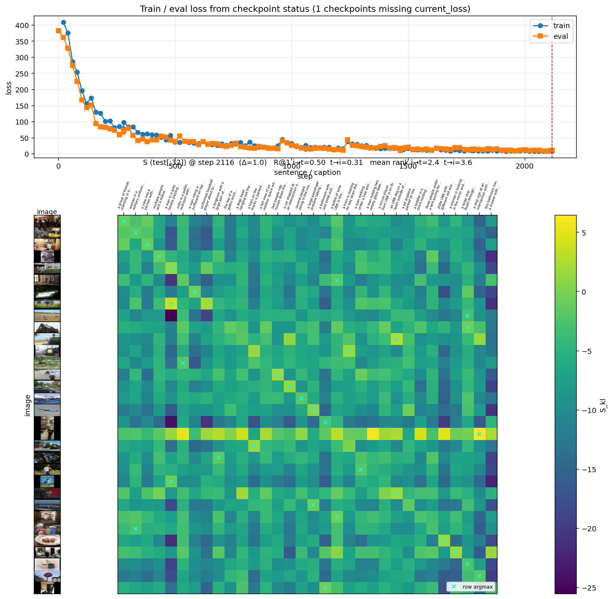
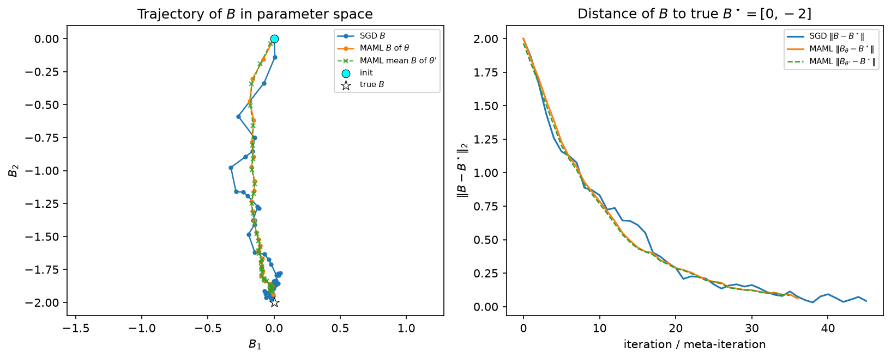
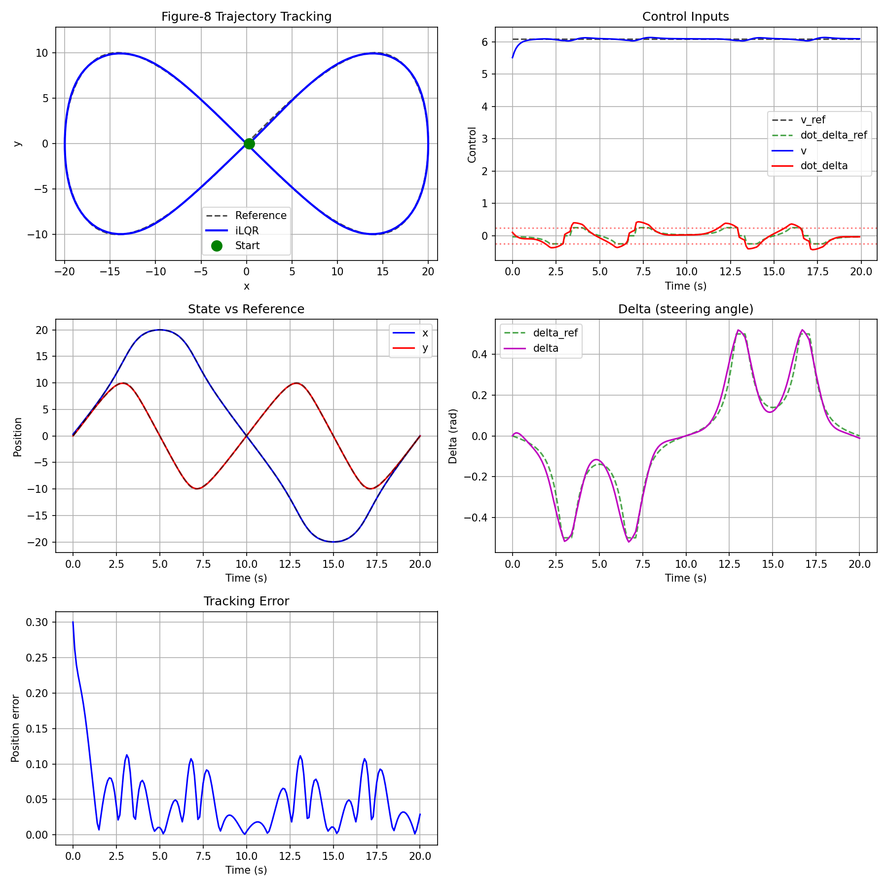
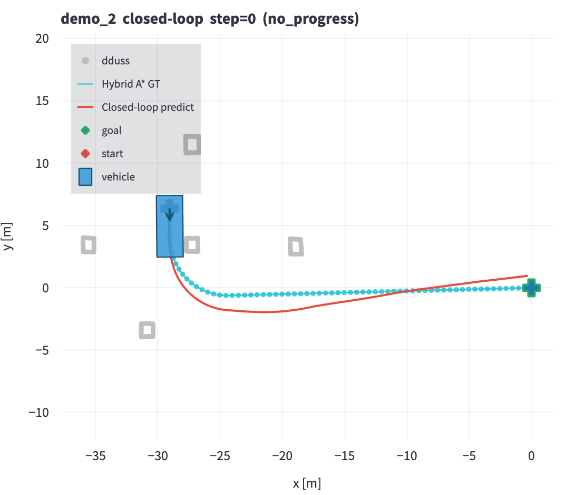
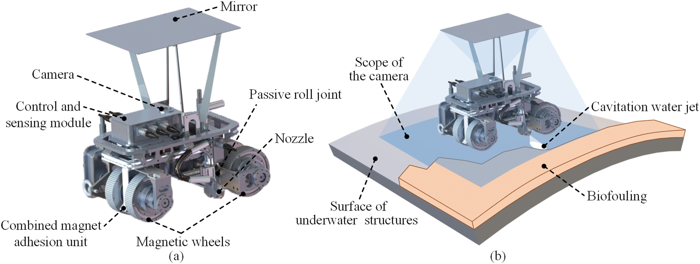

My projects span from Imitation Learning to Search and Optimization.

<table class="project-list">
  <tr>
    <td class="project-thumb">
      
    </td>
    <td class="project-body">
      VisualLanguageAlignment (<a href="https://github.com/JamieHuang28/VisualLanguageAlignment">source code</a>)
      
How to pair given images with given describing sentences? (This is called Visual-Semantic Alignment.) Although <a href="https://karpathy.ai/">Karpathy</a> himself implements an image description generation model, <a href="https://github.com/karpathy/neuraltalk2">NeuralTalk2</a>, for the paper <a href="https://cs.stanford.edu/people/karpathy/deepimagesent/">Karpathy et al. CVPR 2015</a>, the Visual-Semantic Alignment model is left blank. This project provides a complete implementation in an up-to-date transformer style.

    </td>
  </tr>
  <tr>
    <td class="project-thumb">
      
    </td>
    <td class="project-body">
      MEMOofMAML: a simple illustrative memo of meta-learning (<a href="https://github.com/JamieHuang28/MEMOofMAML">source code</a>)
      
<a href="https://arxiv.org/abs/1703.03400">MAML (model-agnostic meta-learning)</a> is an algorithm that can "pretrain" a neural network with few-shot learning. It is applicable to all learning tasks without any change of model. This document is a memo that tries to illustrate this classic work clearly.

    </td>
  </tr>
  <tr>
    <td class="project-thumb">
      
    </td>
    <td class="project-body">
      iLQR from Scratch (<a href="https://github.com/JamieHuang28/iterative-linear-quadratic-regulator">source code</a>)
      
iLQR (iterative linear quadratic regulator) is a variant of the LQR (linear quadratic regulator) method for application in nonlinear dynamic systems. This project provides:

      <ul>
        <li>Example of UFO Rotation Control</li>
        <li>Example of Vehicle Driving Control</li>
        <li>Full documentation of LQR and iLQR</li>
      </ul>
    </td>
  </tr>
  <tr>
    <td class="project-thumb">
      
    </td>
    <td class="project-body">
      Distill hybrid A* to Model(<a href="https://github.com/JamieHuang28/hybrid_astar_algorithm">under recovery</a>)
      
By intuition, SOTA hybrid A* is a good teacher for a model. This project builds a model based on transformer, with 0.003B parameters. (It was implemented during my career at Momenta, but the source code is missing for now. Only code of hybrid A* is temporarily provided)

    </td>
  </tr>
  <tr>
    <td class="project-thumb"></td>
    <td class="project-body">
      NanoNonlinearOptimizationSolver (<a href="https://github.com/JamieHuang28/NanoNonlinearOptimizationSolver">source code</a>)
      
This mini project implements a prototype of a nonlinear solver with only hundreds of lines of code.

    </td>
  </tr>
  <tr>
    <td class="project-thumb">
      
    </td>
    <td class="project-body">
      underwater-cleaning-robot-ros (<a href="https://github.com/JamieHuang28/underwater-cleaning-robot-ros">source code</a>)
      
UCR (Underwater Cleaning Robot) is a project of the HOME (Human-machine Ocean Mechanic Engineering) team, College of Mechanical Engineering, Zhejiang University. UCR packages are developed on ROS. This package is a collection of packages used on UCR, such as the simulation package and the running-online package.

    </td>
  </tr>
</table>
