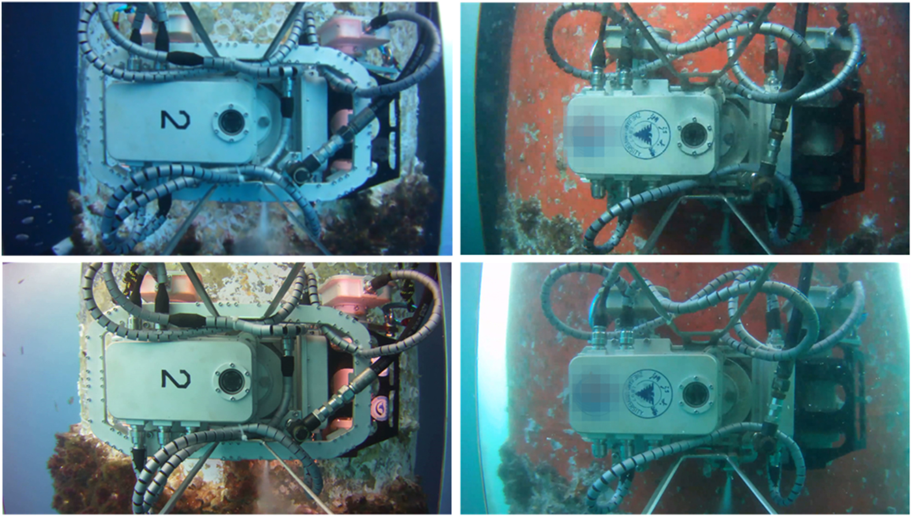
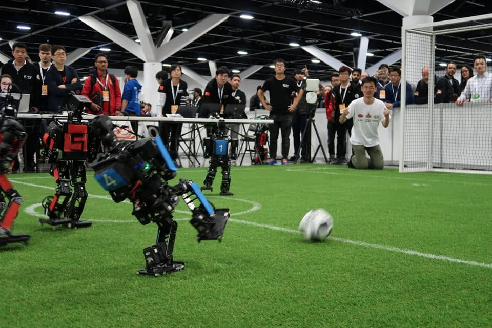
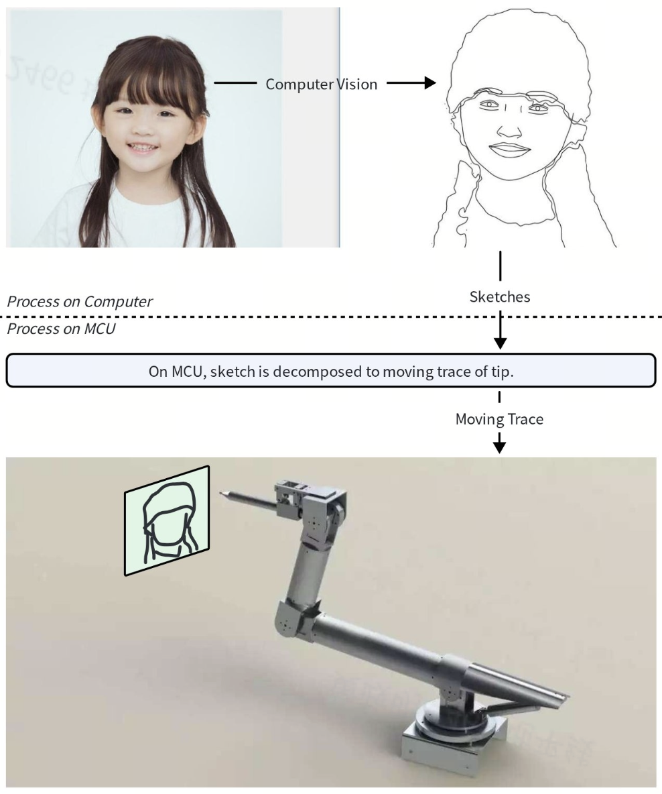

## Working Experience

### Horizon Robotics Co., Ltd. (2 years)

Staff engineer of NOA (Navigate on Autopilot). Go through the tech-paradigm transition from Rule-based Planning to E2E Model.

### Momenta Co., Ltd. (5 years)

Tech Lead of AVP-PnC and APA-PnC. Complete 3 generations of PnC algorithm. The 1st generation is hybrid A* algorithm, which is general but not human-like. The 2nd generation is human-experienced programming, which is human-like but not general. The 3rd generation is hybrid A* based on DL heuristic, which is human-like and general.

### Huawei 2012Lab (Internship)

Visualization of CNN with Deconvolution method based on Caffe.

## Education

### College

#### 1st Prize in 4th Design Competition of Petroleum Equipment (9%, National Level)

Designed the whole software stack of this robot based on ROS (the first ROS package in my lab). The main functions are teleoperation and automatic biofouling boundary tracking control. For the auto-tracking function, I designed the traverse path planning algorithm and the MPC controller. Experiment is conducted on the steel structure of East China Sea oil platform.

Code is available: [underwater-cleaning-robot-ros](https://github.com/JamieHuang28/underwater-cleaning-robot-ros)

#### 2nd Place in RoboCup 2015 Humanoid League (International Level)

Designed the walking solution based on ZMP (Zero Moment Point). Improve performance of vision tracking.

#### Excellent Project in SRTP (Student Research Training Program) with project PROW (Painting Robot On Web) (5%, School Level)

Propose a service of portrait painting on web. In this service, user upload their photo on web and watch the realtime painting procedure. This is a quite integrated project, which covers computer vision, sketch plan algorithm, multi-joint motion decomposition and MCU programming. Though it doesn't work as expected, it is still an outstanding project in the school.

### High School

3rd Place (Province Level) in Physics Competition in senior high school, therefore recommended to THU (Biological Department) & PKU (Medical Department) & SJTU & ZJU without examination.

## Personal Interest

### Music

I act as bass player in my band Madame Roland.

I also love classical music. This is a photo shot in Vienna.

### Airplane Model

I have played airplane model since college. I prefer fixed-wing model aircraft.

